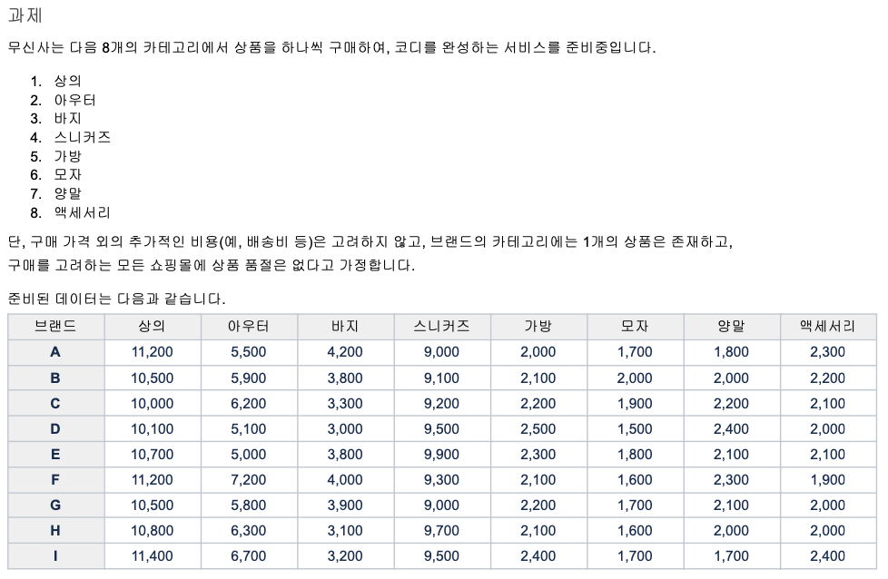

# 무신사 과제
1. 코드 실행시 필요 자바버전
   - Java17 이상
2. 구현 기능
   - 카테고리 별 최저가격 브랜드와 상품가격, 총액을 조회하는 API
     - **한 카테고리에 두개의 최저가가 있을 경우가 있는데, 이러할 경우 예제와 같이 브랜드명이 사전상 뒤에있는것을 출력하도록 하였습니다.**
   - 단일 브랜드로 모든 카테고리 상품을 구매할 때 최저가격에 판매하는 브랜드와 카테고리의 상품가격, 총액을 조회하는 API
     - **최저가가 같은 다수의 브랜드가 나올수 있기에 객체가 아닌 리스트가 리턴되도록 하였습니다.**
   - 카테고리 이름으로 최저, 최고 가격 브랜드와 상품 가격을 조회하는 API
   - 브랜드 및 상품을 추가 / 업데이트 / 삭제하는 API
3. 입력 데이터 
   - 과제에 제시된 대로 프로젝트를 실행할때 마다 삭제및 생성되게 하였습니다.


4. 빌드, 단위테스트 및 실행 (아래 코드블럭 우측 상단의 clone 버튼을 눌러서 copy & paste)
```agsl
git clone https://github.com/JuDaeri/MSSTest.git
cd MSSTest
./gradlew clean build
java -jar ./build/libs/musinsa-test-0.0.1-SNAPSHOT.jar
```

5. 수동 테스트를 위한 Swagger 주소
   - http://localhost:8080/swagger-ui/index.html
